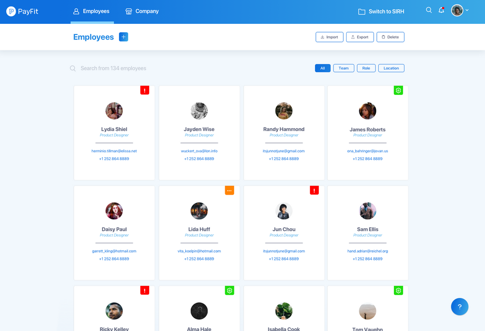

# TP Recuperatorio 2 de LPPA - App de empleados

Copiar el siguiente diseño web utilizando HTML y CSS de forma tal que la web se visualize correctamente en cualquier dispositivo (celular, tablet, laptop y monitor).

---
-- Consigna completa: --

El sitio debe ser responsive, priorizando el uso de Flexbox y debe mostrar un listado de al menos 10 personas. Los datos de las personas y su respectiva foto deben ser obtenidos mediante una consulta HTTP a un API pública (se puede utilizar https://jsonplaceholder.typicode.com como vimos en la clase 12).

El codigo HTML, CSS y JavaScript desarrollado debe ser subido a Github con sus commits correspondientes.

El repositorio debe ser nuevo y exclusivo del recuperatorio del 2do parcial, utilizando un Readme descriptivo y los cambios deben ser visibles en Github Pages.

Se evaluará:

- Correcta funcionalidad de JavaScript.
- Correcto manejo de Eventos del navegador.
- Responsividad del contenido, visible correctamente en celulares, tablets y monitores.
- Cumplimiento de la consigna y los contenidos.
- Contenido completo y prolijo del Readme.
- Prolijidad del codigo realizado, tanto HTML, CSS como JS. Prestar atención a la indentacion, puntuacion, etc.
- Correcto y frecuente uso de commits de Git.
- Correcta visualizacion del sitio en Github Pages.
- Colaboración con los compañeros de clase para mejorar los conocimientos y avanzar como grupo.

---
Link en Github Pages:

https://rubensato.github.io/TP_AppEmpleados/

---
## Licencia y Copyright

© Ruben Sato - Año 2021
